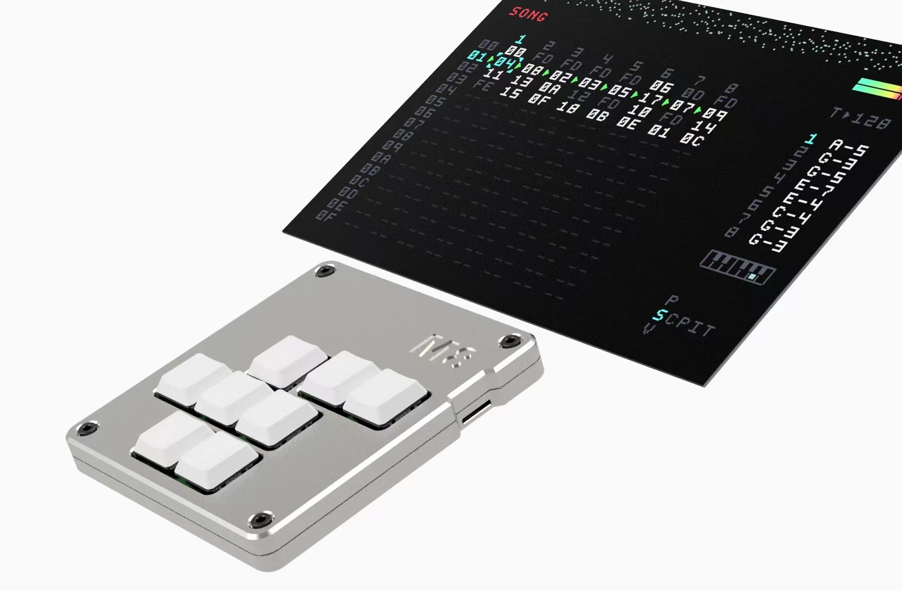
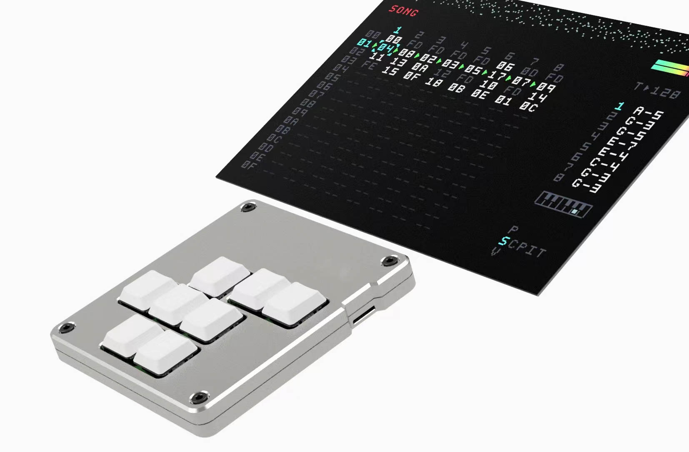
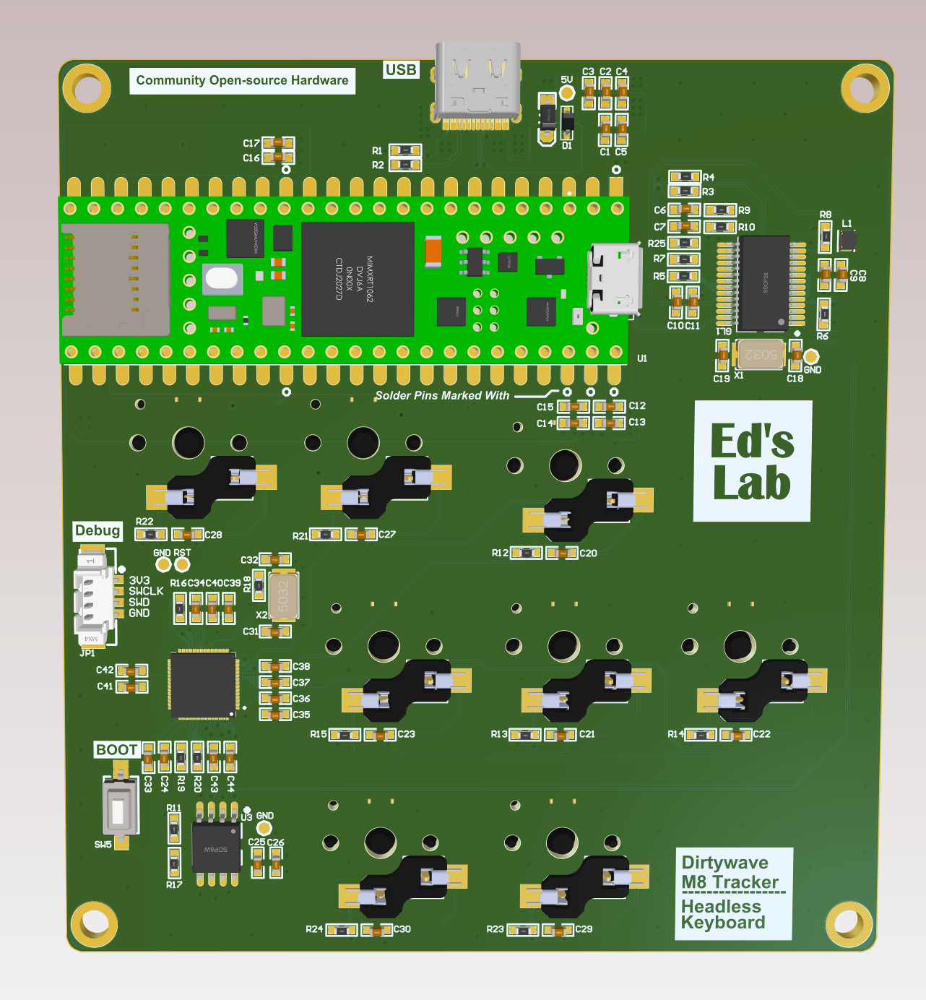
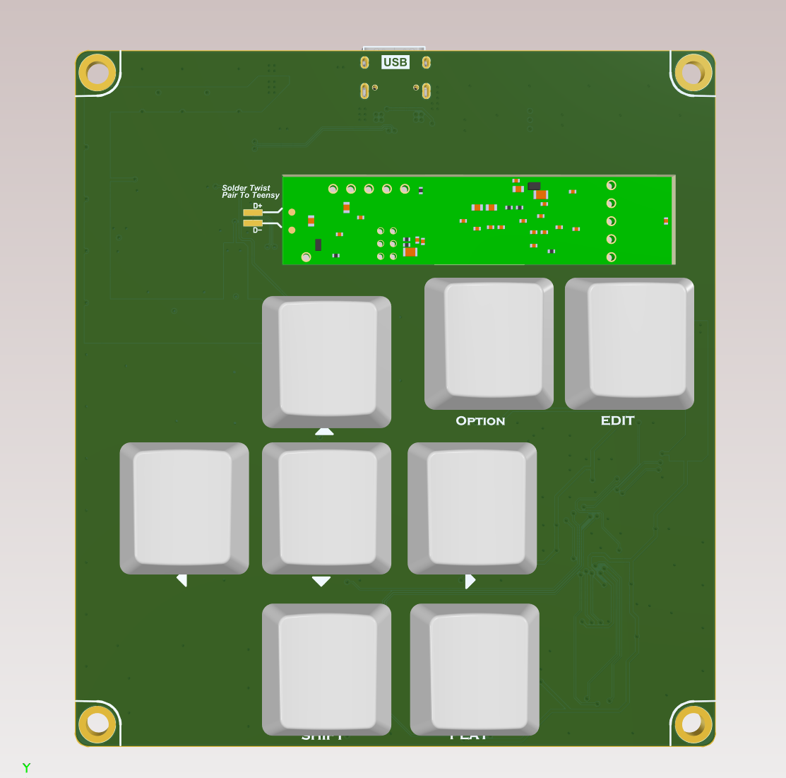
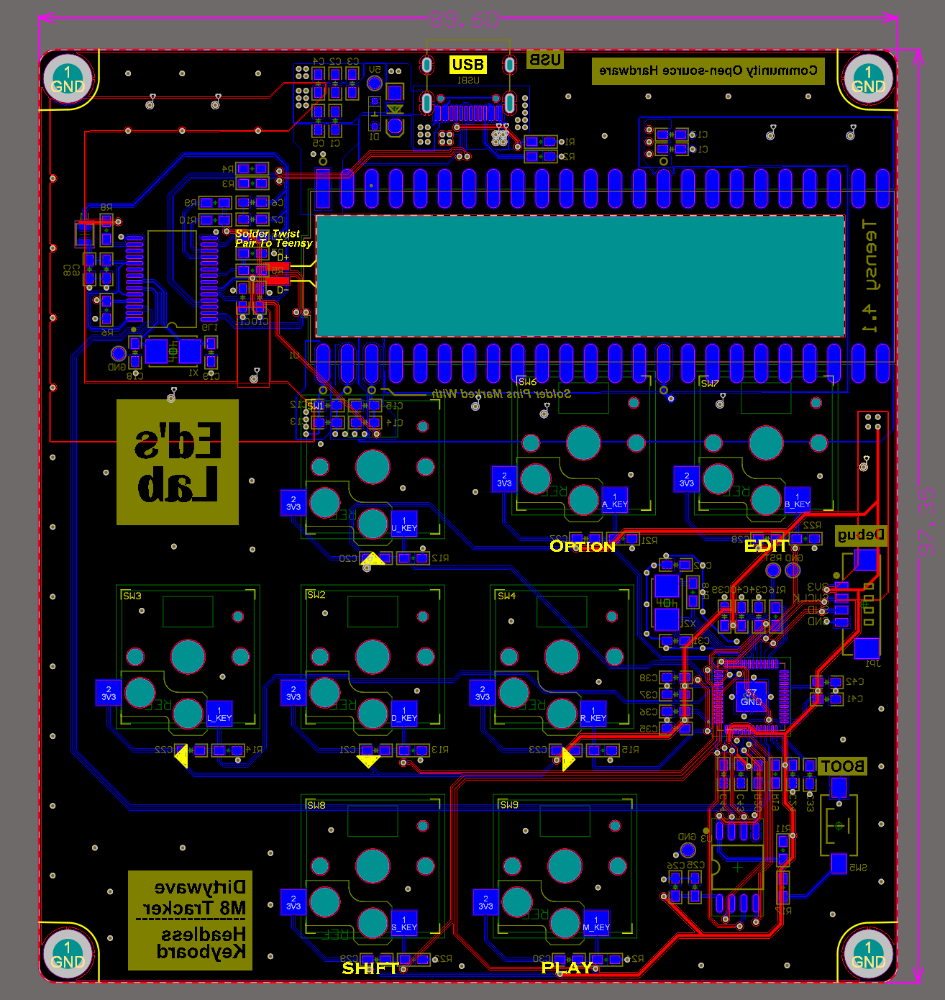
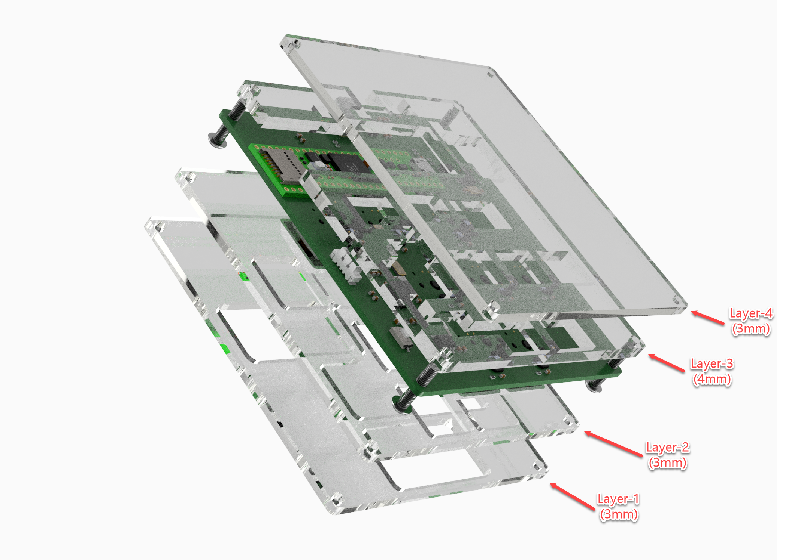
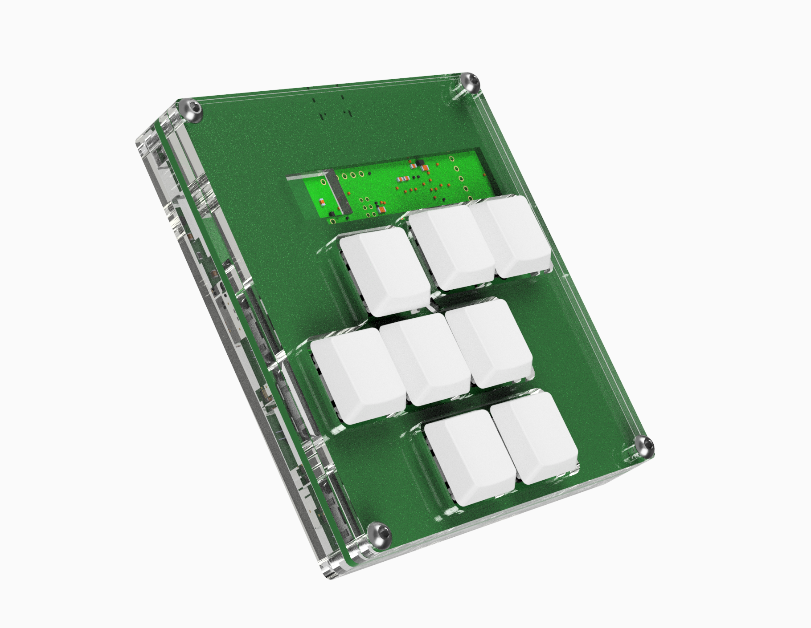

### Fully Assembled units and parts are available here: [Ed's Lab Shop](https://edslab.myshopify.com/) 
Batch update:
The first batch is estimated to be shipped by July 14, 2024.

# Table of Contents
- [Table of Contents](#table-of-contents)
- [Overview](#overview)
- [Features](#features)
- [Hardware Guide](#hardware-guide)
    - [System Diagram](#system-diagram)
  - [Electronics Build Guide](#electronics-build-guide)
    - [Soldering](#soldering)
    - [Tips on Soldering Teensy 4.1](#tips-on-soldering-teensy-41)
  - [PCB Testing](#pcb-testing)
- [Three Versions of Enclosure are Available](#three-versions-of-enclosure-are-available)
    - [Option 1: CNC Machined Enclosure](#option-1-cnc-machined-enclosure)
    - [Option 2: Sandwiching Acrylic Enclosure](#option-2-sandwiching-acrylic-enclosure)
    - [Option 3: 3D Printed Enclosure](#option-3-3d-printed-enclosure)
- [Software Guide](#software-guide)
  - [1. Tracker Headless Firmware (Teensy 4.1)](#1-tracker-headless-firmware-teensy-41)
  - [2. Keyboard Firmware (RP2040 MCU)](#2-keyboard-firmware-rp2040-mcu)
    - [Keyboard Firmware Highlights](#keyboard-firmware-highlights)
    - [Pre-built keyboard firmware can be found here --\>  Keyboard Firmware](#pre-built-keyboard-firmware-can-be-found-here-----keyboard-firmware)
    - [Steps for Flashing Keyboard Firmware:](#steps-for-flashing-keyboard-firmware)

# Overview
This is a slightly over-engineered tracker keyboard that integrates both Teensy4.1 and a keyboard.

>>>>>>> a3ef860526b9f367cf588954446d36c82bc5aed3
<div style="display: flex; flex-direction: row; margin-top: 20px;">
  
</div>

<div style="display: flex; flex-direction: row; margin-top: 50px;">
  
</div>


# Features
- Built-in USB HUB connected to both Teensy 4.1 and Keyboard
- Keyboard is implemented with RP2040 microcontroller
- Same swappable mechanical keyboard as the original
- High-quality CNC machined case, providing the same handling experience as the original
- Robust connection with USB-C screw lock cable
  
# Hardware Guide
### System Diagram 


## Electronics Build Guide
PCB (Back)          |  PCB (Front) |  Layer View
:-------------------------:|:-------------------------:|:-------------------------:
 |  | 

PCB manufacture requirements: 
- Layers: `2-Layers`
- Board thickness: `1.6mm`
- Board dimensions: 90mm x 97.35mm 

All the components are 0603 footprints. The pads are designed with larger pads, making them great for hand-soldering. The most complex component in this project is the RP2040, which is in a QFN package, so hot-air reflow is required. An alternative approach is to make a custom PCB stencil, which would make the process much easier.

### Soldering
The stencil and reflow oven approach is demonstrated below and recommended. 
PCB | Stencil and Solder Paste | Pick and Place | Reflow Oven
:-:|:-:|:-:|:-:
 | |  | 

### Tips on Soldering Teensy 4.1 
- Solder the pins that are marked with circles. Only 6 pins are required for soldering. This is enough to hold the board while still being easy to de-solder and repurpose if needed. To solder, add some solder flux onto the pads. Solder one pin first and ensure it's aligned properly. Place the soldering iron on the Teensy through-hole pad, and add a generous amount of solder. Hold the iron longer, around 8-15 seconds, and let the solder sink into the pad below.
  - 

- Make a twisted wire for Teensy USB communication. Solder it and adding adhesive glue is recommended.
  - 

## PCB Testing
  

🎉🎉🎉 Great job on finishing the PCB assembly. Now we will go through a checklist and testing process to help you get your tracker keyboard up and running!

- Visually check that all components are soldered properly with no solder bridges or shorts.
- Before connecting to a PC, check that your 5V and 3V3 are not shorted to ground.
- Note that the RP2040 is powered by Teensy's on-board DC converter, so the Teensy must be soldered in order for the RP2040 to work properly.
- Follow the Software Guide section for flashing tutorials.
- You can always open the Device Manager on your PC to check if all devices are being detected properly. Three devices should show up:
  - A `USB 2.0 Hub` device
  - An Tracker `Serial` and `Audio` composite device
  - A `HID Keyboard` device


# Three Versions of Enclosure are Available
### Option 1: CNC Machined Enclosure
Best quality and experience. It's a CNC machined enclosure that offers a great hand-held experience.
```
Bill of Materials
- x4 M3x8mm screws 
- x1 CNC top and bottom case 
- x1 Optional, USB Type-C cable with screw lock (The pitch distance of the two screws is 15mm, and the size is M2 thumb screws)
- x4 8mm x 1.5mm rubber pads
- x1 12mmx12mmx1mm Thermal Pad 
```

<!--  -->

### Option 2: Sandwiching Acrylic Enclosure
A 4-layer acrylic sandwiching approach offers handling weight and durability while keeping the price cheaper compared to CNC. Note that the USB lock threads are not available in this design. The `*.dxf` files of each layer are provided for laser cut manufacturing.

How to assemble?
- Stack them up. The hole size on the layer-4 plate is slightly smaller, so screw taps will be created when screwing in the screws.
```
Bill of Materials
- x4 M3x14mm screws 
- x1 Layer 1 Acrylic (3mm thick)
- x1 Layer 2 Acrylic (3mm thick)
- x1 Layer 3 Acrylic (4mm thick)
- x1 Layer 4 Acrylic (3mm thick)
```



Assembled (Front)          |  Assembled (Back)
:-------------------------:|:-------------------------:
 | 

### Option 3: 3D Printed Enclosure
This 3D printed design is nearly identical to the CNC version but optimized for 3D printing. Note that the USB lock threads are not available in this design.

How to assemble?
- The hole size on the bottom case is slightly smaller, so screw taps will be created when screwing in the screws.
```
==== Print settings ==== 
- PLA or ABS filament  
- 25% infill  
- Support enabled  

==== Bill of Materials ====  
- x4 M3x8mm screws 
- x1 Printed top and bottom case
```

Slicer Build Plate         |
:-------------------------:|
 
<!--  -->

# Software Guide
Two firmware flashes are required:
1. Tracker Headless firmware on Teensy
2. Keyboard firmware on the RP2040 microcontroller

## 1. Tracker Headless Firmware (Teensy 4.1)
- Pre-compiled Tracker Headless Firmware and flashing guide can be found here: [Headless Firmware](https://github.com/Dirtywave/M8HeadlessFirmware)
- This is a pretty standard process and can be done easily.

## 2. Keyboard Firmware (RP2040 MCU)
The keyboard is implemented with RP2040 keyboard HID implementation. You wouldn't need to build this source file yourself. Pre-built firmware is available for easy flashing.

### Keyboard Firmware Highlights
- Implemented in C++, offering better low-latency input compared to MicroPython.
- Single firmware file. Drag and drop for a simple and fast upload process.
- No more annoying MicroPython disk pop-up every time the device is connected.
- HID key mapping: 
    (key mapping is the same as [M8 WebDisplay's](https://derkyjadex.github.io/M8WebDisplay/) default)
    | Tracker Hardware Keys | Mapped HID Keys|
    |------------------|------------------|
    |Arrow Keys| Arrow Keys|
    |Option| Z |
    |Edit| X |
    |Shift| Left Space |
    |Play| Space Bar |

### Pre-built keyboard firmware can be found here -->  [Keyboard Firmware](software/Release)
### Steps for Flashing Keyboard Firmware:
- Download the single firmware `pico-tracker-keyboard.uf2` file from the [Release](software/Release) Folder.
- "Press and Hold" the `Boot` button on the RP2040 PCB board, connect the USB to your PC, then release the `Boot` button.
- A disk will show up or get mounted, indicating that your RP2040 is in loader mode and ready to load firmware.
- Simply drag and drop the `pico-tracker-keyboard.uf2` firmware file to the mounted disk.
- The RP2040 will then unmount and reboot itself with the new firmware.
