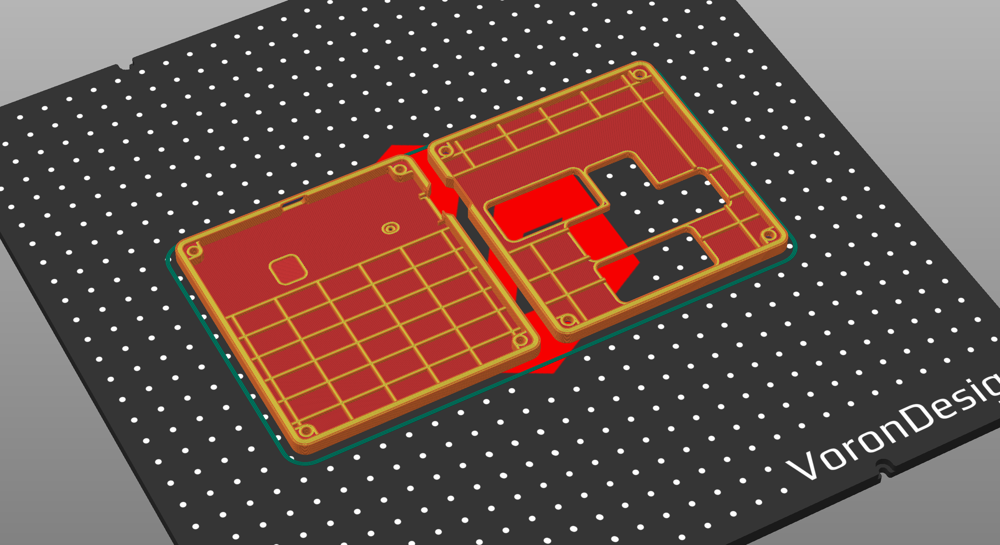

# Table of Contents
- [Overview](#Overview)
- [Features](#Features)
- [Hardware Guide](#Hardware-Guide)
    - [The Build](#The-Build)
    - [Three versions of enclosure available](#Three-versions-of-enclosure-available)
- [Software Guide: Two Firmwares](#Software-Guide)  
    - [M8 Headless Firmware (Teensy 4.1)](#M8-Headless-Firmware-Teensy-4.1)
    - [Keyboard Firmware (RP2040 MCU)](#Keyboard-Firmware-RP2040-MCU)
            


# Overview
This is an over-engineered version of headless Dirtywave M8 tracker.


# Features
- Build USB HUB connected both Teeny4.1 and Keyboard
- Keyboard is implemented with RP2040 microcontroller
- Same Swapable Mechnical Keyboard as the original
- High quality CNC machined case. Providing the same handeling experience as the original
- Robust connection with USB-C screw lock cable
  
# Hardware Guide
PCB manufactre requirement: 2-Layers PCB, 1.6mm thick
### The Build
[This section is WIP]

# Three versions of enclosure available
### Option 1: CNC Machined Enclosure
- BOM:
[This section is WIP]
### Option 2: Sandwitching Acrylic Enclosure
- BOM: 
[This section is WIP]
### Option 3: 3D Printed Enclosue
```
Print settings:  
    - PLA or ABS filliment  
    - 25% infill  
    - Support enabled  
```



# Software Guide
Two firmware flashing is required.
1. M8 Headless firmware on Teensy
2. eyboard firmware on RP2040 microcontroller

## 1. M8 Headless Firmware (Teensy 4.1)
- Pre-compiled Dirtywave M8 Firmware and flashing guide can be found here: [Dirtywave Headless Firmware](https://github.com/Dirtywave/M8HeadlessFirmware)
- This is pretty standard process and can be done 


## 2. Keyboard Firmware (RP2040 MCU)
The keyboard feature is implemented with RP2040 keyboard HID implementation. You wouldn't need to build this source file yourself. Pre-built firmware is available for easy flashing. 

### Keyboard Firmware Highlights:
- Implemented in C++, better low latency input compared to MicroPython.
- Single firmware file. Drag and drop. Simple and fast upload process
- No more annoying micro-python disk pop-up everytime when the device is connected
- Firmware M8 HID key mapping: 
    (key is same as [M8-WebDisplay's](https://derkyjadex.github.io/M8WebDisplay/) default)
    | M8 Keys | Mapped HID Keys|
    |------------------|------------------|
    |Arrow Keys| Arrow Keys|
    |Option| Z |
    |Edit| X |
    |Shift| Left Space |
    |Play| Space Bar |


### Pre-build keyboard firmware can be found here -->  [Keyboard Firmware](software/Release)
### Steps for flashing keyboard firmware:
- Download single firmware `pico-m8-keyboard.uf2` file from the [Release](software/Release) Folder
- "Press and Hold" the `Boot` button on the RP2040 PCB board, and connect the usb to your PC, then release `Boot` button.
- A disk will showup or mounted. It means you RP2040 is in loader mode and ready to load firmware.
- Simply drag and drop the `pico-m8-keyboard.urf` firmware file to the mounted disk.
- RP2040 will then unmount and reboot itself to new firmware  
